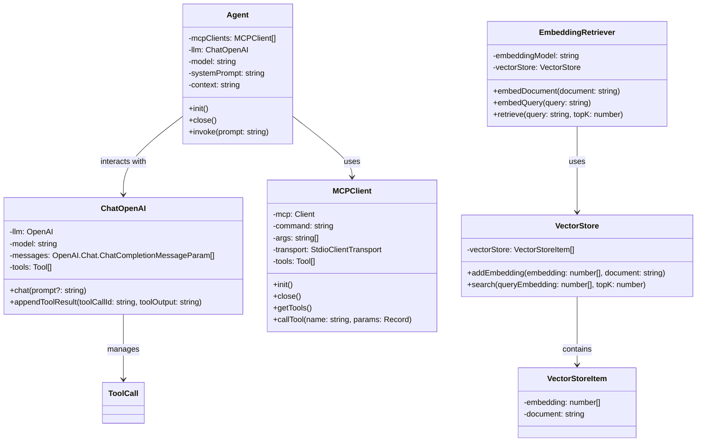

# LLM + MCP + RAG TypeScript Version

## 目标

- **Augmented LLM** (Chat + MCP + RAG)
- 不依赖框架
    - LangChain, LlamaIndex, CrewAI, AutoGen
- **MCP**
    - 支持配置多个MCP Serves
- **RAG** 极度简化板
    - 从知识中检索出有关信息，注入到上下文
- **任务**
    - 阅读网页 → 整理一份总结 → 保存到文件
    - 本地文档 → 查询相关资料 → 注入上下文

## **The augmented LLM**

- [Building Effective Agents](https://www.anthropic.com/engineering/building-effective-agents)

