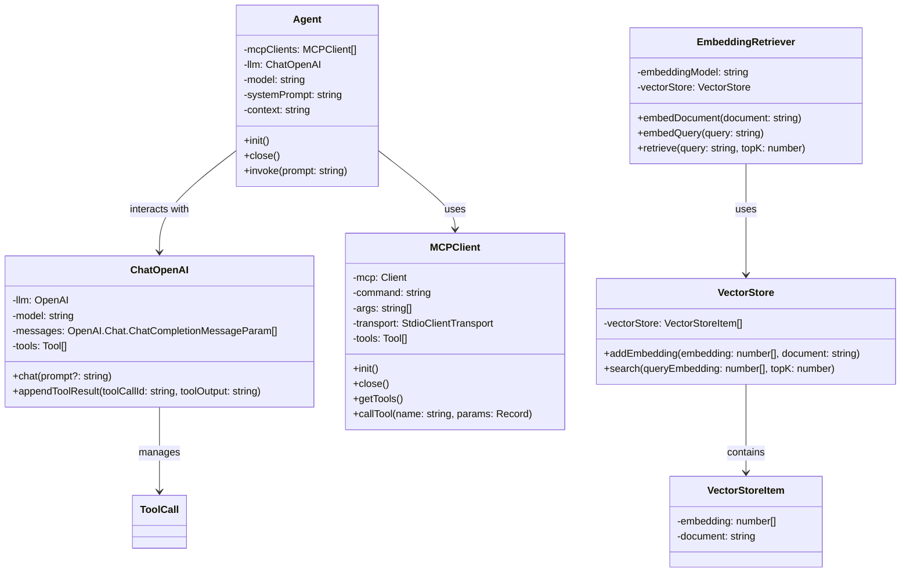

# LLM + MCP + RAG TypeScript Version

构建一个轻量、无框架依赖的增强型大语言模型智能体（Augmented LLM Agent），结合 Chat + MCP + RAG，支持多任务智能处理流程，例如网页阅读总结、本地文档问答等。

Build a lightweight, framework-free Augmented LLM Agent powered by Chat + MCP + RAG, supporting intelligent workflows like web summarization and document-grounded Q&A.


## Key Features

- **无框架依赖 Framework-Free**
  - 不依赖 LangChain、LlamaIndex、CrewAI、AutoGen 等第三方框架，自主构建，透明可控。
  - No LangChain, LlamaIndex, CrewAI, or AutoGen — built from scratch with full control.
- **支持多个 MCP 实例Multi-MCP Support**
  - 可配置并同时连接多个 MCP（Model Context Protocol）服务器，实现模型调用与工具调度的灵活切换。
  - Connect to one or more MCP servers for model execution and tool integration.
- **极简 RAG 引擎 Minimal RAG Engine**
  - 通过本地检索获取上下文，仅注入相关内容，无多余抽象层，简单清晰。
  - Lightweight RAG: retrieve relevant context and inject directly into prompts — no complexity.

## **The augmented LLM**

- [Building Effective Agents](https://www.anthropic.com/engineering/building-effective-agents)




## How to start

### 1. Install dependencies

```bash
   pnpm install
   
   brew install uv
 ```

> uv is required to run MCP servers. You can skip it if you're not using local MCP backends.

### 2. Configure environment variables

```env
OPENAI_API_KEY=
OPENAI_BASE_URL=
```

### 3. Write your task prompt

Add your task prompt in the `prompts/` directory.
For example:
```shell
prompts/task2_hackernews_csv.md
```

### 4. Run the agent

```bash
pnpm dev run
```

## MCP

- [MCP Architecture](https://modelcontextprotocol.io/docs/concepts/architecture)
- [MCP Client](https://modelcontextprotocol.io/quickstart/client)
- [Fetch MCP](https://github.com/modelcontextprotocol/servers/tree/main/src/fetch)
- [Filesystem MCP](https://github.com/modelcontextprotocol/servers/tree/main/src/filesystem)