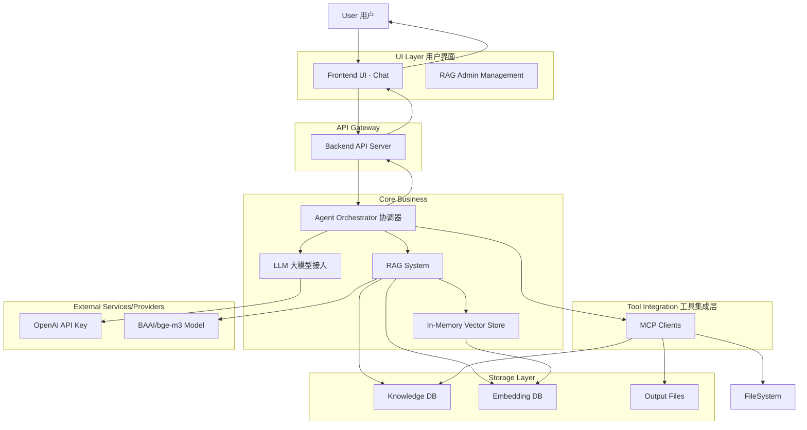
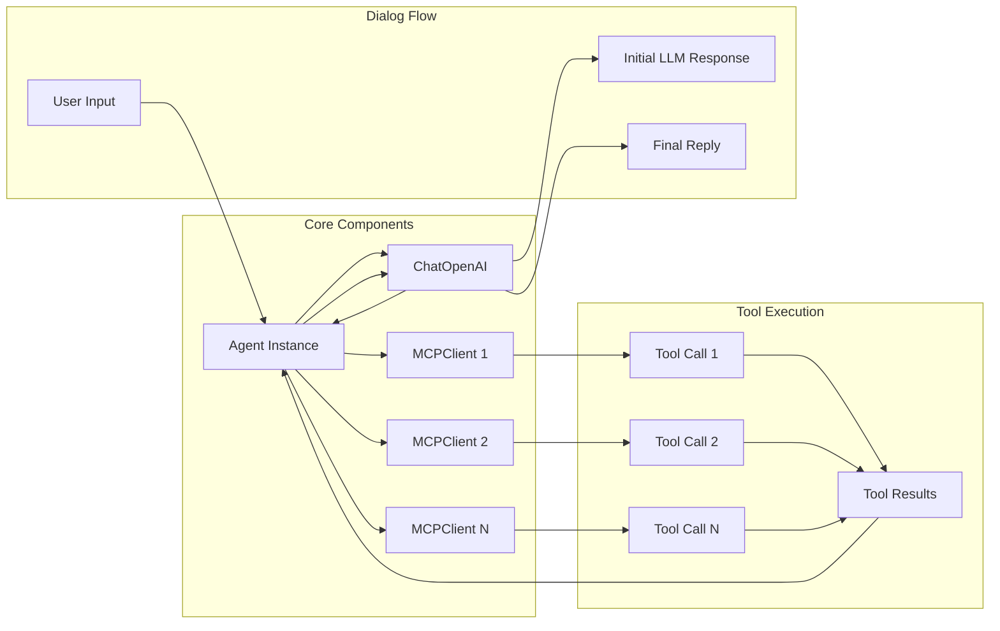
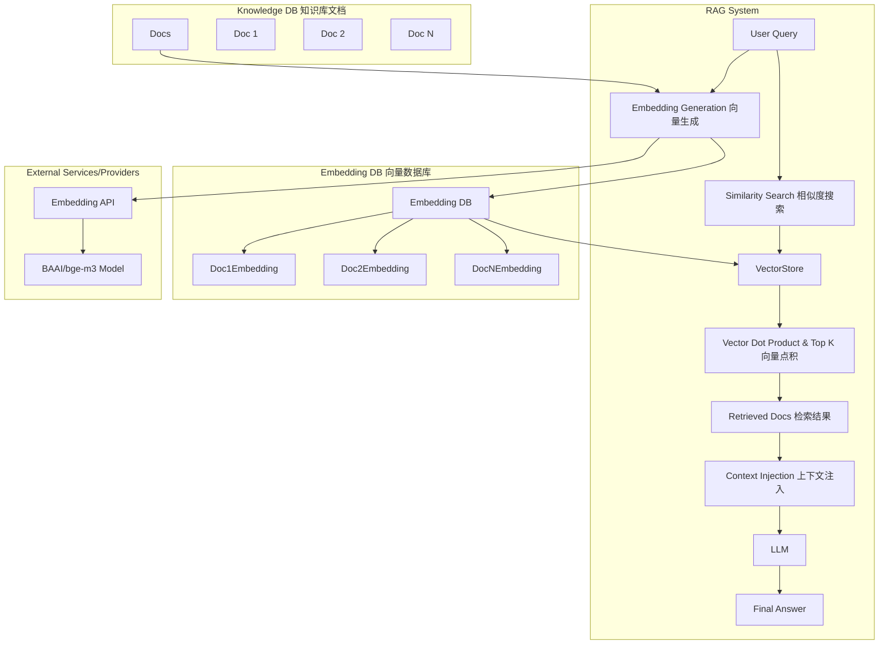
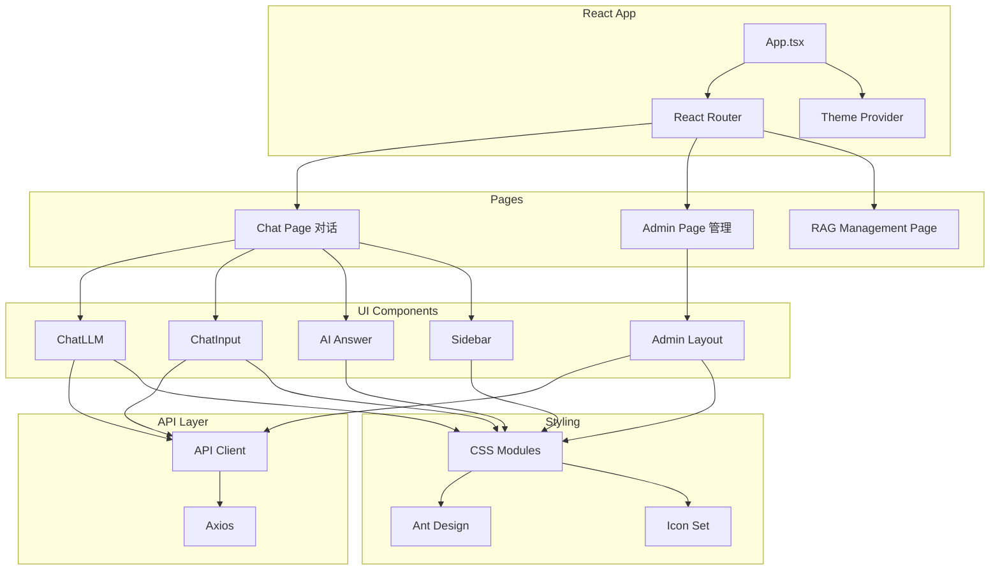
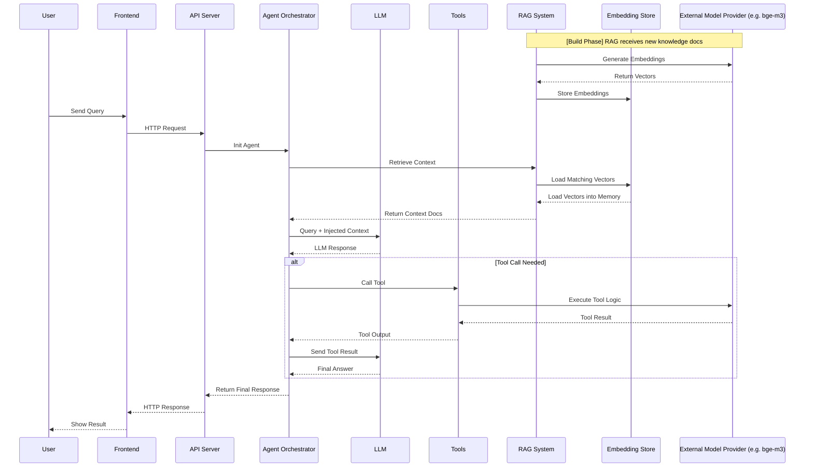
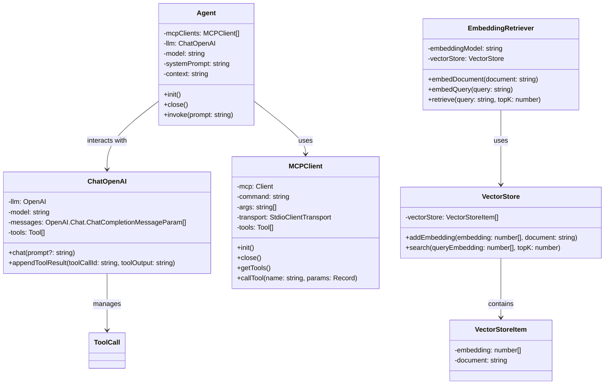

# LLM + MCP + RAG TypeScript Version

Build a lightweight, framework-free Augmented LLM Agent in TypeScript, featuring multi-MCP tool orchestration, in-memory RAG knowledge retrieval, real-time chat, and a modern web interface for intelligent document Q&A, web summarization, and automated workflows.

> 基于TypeScript构建的轻量级无框架增强型大语言模型智能体，集成多MCP工具编排、内存RAG知识检索、实时聊天与现代Web界面，支持智能文档问答、网页摘要和自动化工作流。

## Key Features

- **Framework-Free**
    - No LangChain, LlamaIndex, CrewAI, or AutoGen — built from scratch with full control.
    - 不依赖第三方框架，自主构建，透明可控。
- **Multi-MCP Support for LLM and Tool Orchestration**
    - Connect to one or more MCP servers for model execution and tool integration.
    - 支持多个 MCP 服务并行编排，实现模型推理与工具调用的灵活调度与切换
- **RAG Engine & In-Memory Vector Engine (Backend & Frontend)**
    - Upload and manage knowledge documents. 上传和管理知识库
    - Generate embeddings with `BAAI/bge-m3` for knowledge documents each from Embedding Model Provider.
    - Run-time injects vectors in memory for fast similarity search. 运行时注入向量在内存中以进行快速相似性搜索.
    - Compute similarity via dot product, retrieve only the most relevant Top K content. 通过点积计算相似度，仅检索最相关的内容.

## System Architecture



## Agent Internal Architecture



## RAG Architecture



## Frontend Architecture



## Data Flow Sequence Diagram



## **The augmented LLM**

- [Building Effective Agents](https://www.anthropic.com/engineering/building-effective-agents)




## How to start

### 1. Install dependencies

```bash
   pnpm install
   
   brew install uv
 ```

> uv is required to run MCP servers. You can skip it if you're not using local MCP backends.

### 2. Configure environment variables

```env
# LLM API Provider
OPENAI_API_KEY=
OPENAI_BASE_URL=

# External Embedding Model Provider
EMBEDDING_KEY=
EMBEDDING_BASE_URL=

#DB as Storage, we use MongoDB
#DATABASE_URL=
```
### 3. Local Start Testing Function (only `Index.ts` as demo)
#### 3.1 Write your task prompt

Add your task prompt in the `prompts/` directory.
For example:

```shell
prompts/task2_hackernews_csv.md
```

#### 3.2 Run the agent

```bash
pnpm run dev
```

### 4. Run Backend Server and Frontend UI as Application

```bash 
pnpm run setup
pnpm run all
```


## MCP

- [MCP Architecture](https://modelcontextprotocol.io/docs/concepts/architecture)
- [MCP Client](https://modelcontextprotocol.io/quickstart/client)
- [Fetch MCP](https://github.com/modelcontextprotocol/servers/tree/main/src/fetch)
- [Filesystem MCP](https://github.com/modelcontextprotocol/servers/tree/main/src/filesystem)