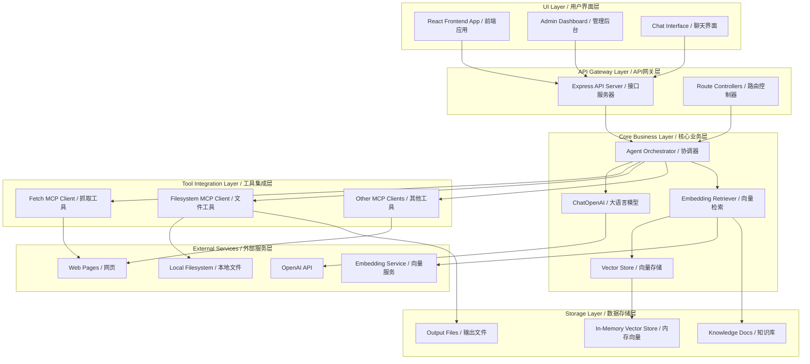
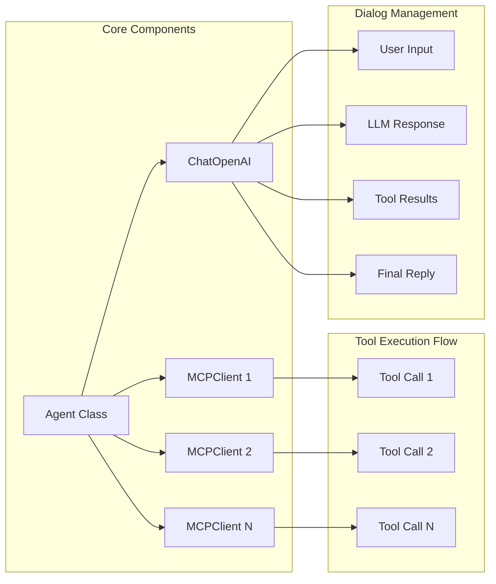
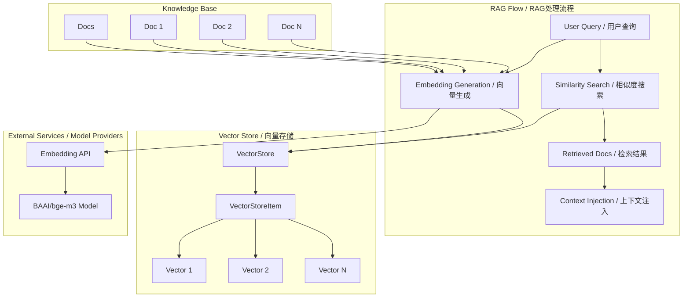
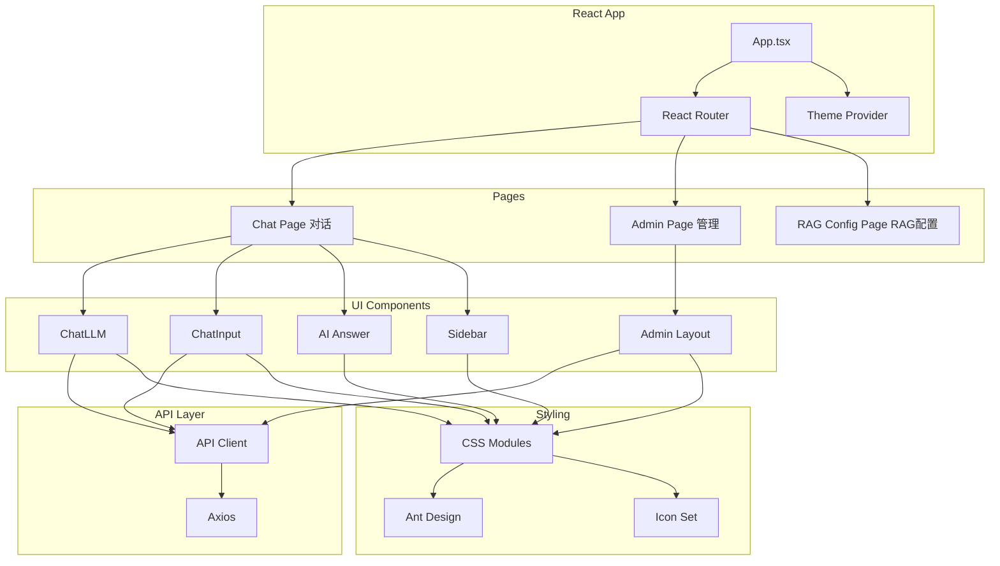
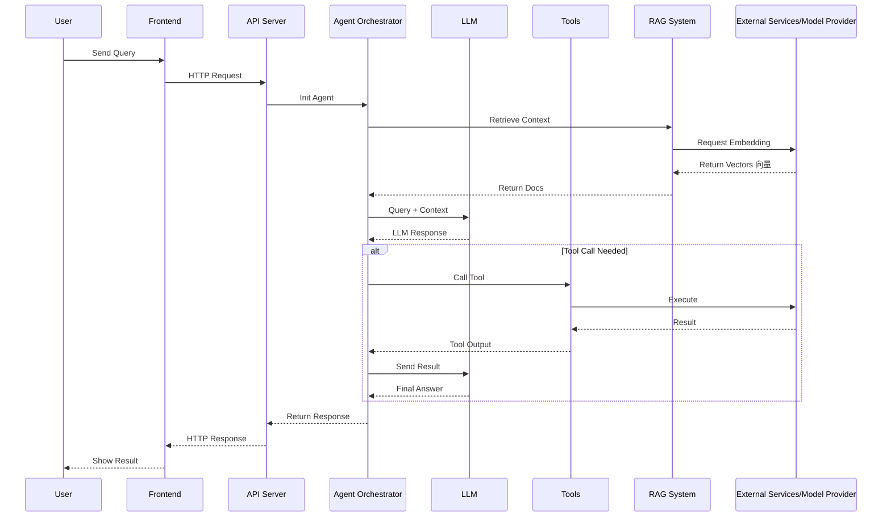
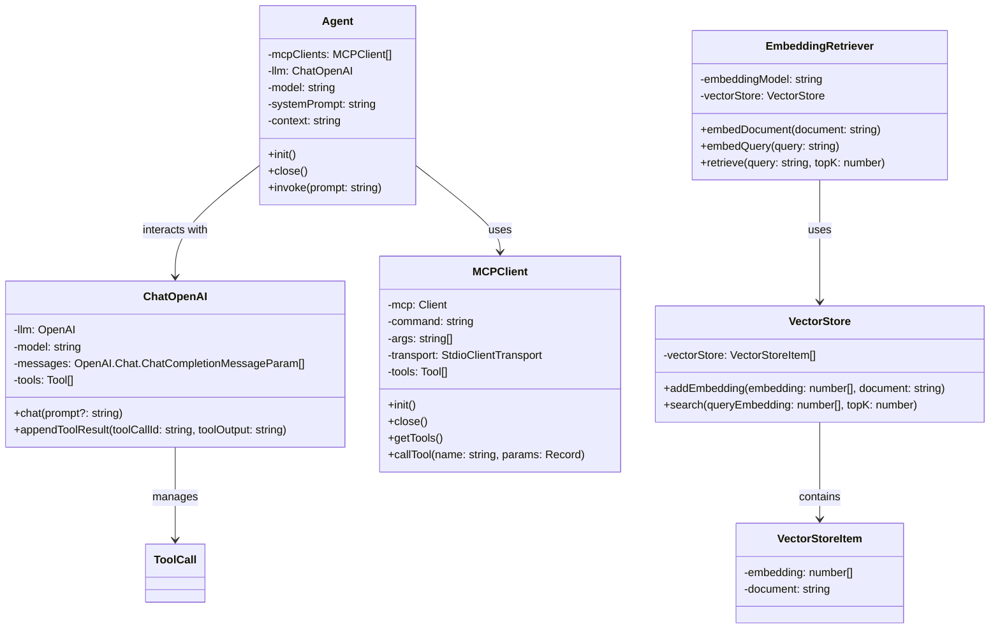

# LLM + MCP + RAG TypeScript Version

构建一个轻量、无框架依赖的增强型大语言模型智能体（Augmented LLM Agent），结合 Chat + MCP + RAG，支持多任务智能处理流程，例如网页阅读总结、本地文档问答等。

Build a lightweight, framework-free Augmented LLM Agent powered by Chat + MCP + RAG, supporting intelligent workflows
like web summarization and document-grounded Q&A.

## Key Features

- **Framework-Free**
    - No LangChain, LlamaIndex, CrewAI, or AutoGen — built from scratch with full control.
    - 不依赖第三方框架，自主构建，透明可控。
- **Multi-MCP Support for LLM and Tool Orchestration**
    - Connect to one or more MCP servers for model execution and tool integration.
    - 支持多个 MCP 服务并行编排，实现模型推理与工具调用的灵活调度与切换
- **RAG Engine & In-Memory Vector Engine (Backend & Frontend)**
    - Upload and manage knowledge documents. 上传和管理知识库
    - Generate embeddings with `BAAI/bge-m3` for knowledge documents each from Embedding Model Provider.
    - Run-time injects vectors in memory for fast similarity search. 运行时注入向量在内存中以进行快速相似性搜索.
    - Compute similarity via dot product, retrieve only the most relevant Top K content. 通过点积计算相似度，仅检索最相关的内容.

## System Architecture



## Agent Internal Architecture



## RAG Architecture



## Frontend Architecture



## Data Flow Sequence Diagram



## **The augmented LLM**

- [Building Effective Agents](https://www.anthropic.com/engineering/building-effective-agents)




## How to start

### 1. Install dependencies

```bash
   pnpm install
   
   brew install uv
 ```

> uv is required to run MCP servers. You can skip it if you're not using local MCP backends.

### 2. Configure environment variables

```env
OPENAI_API_KEY=
OPENAI_BASE_URL=
```
### 3. Local Start Testing Function (`Index.ts`)
#### 3.1 Write your task prompt

Add your task prompt in the `prompts/` directory.
For example:

```shell
prompts/task2_hackernews_csv.md
```

#### 3.2 Run the agent

```bash
pnpm run dev
```

### 4. Run Backend Server and Frontend UI as Application

```bash 
pnpm run setup
pnpm run all
```


## MCP

- [MCP Architecture](https://modelcontextprotocol.io/docs/concepts/architecture)
- [MCP Client](https://modelcontextprotocol.io/quickstart/client)
- [Fetch MCP](https://github.com/modelcontextprotocol/servers/tree/main/src/fetch)
- [Filesystem MCP](https://github.com/modelcontextprotocol/servers/tree/main/src/filesystem)