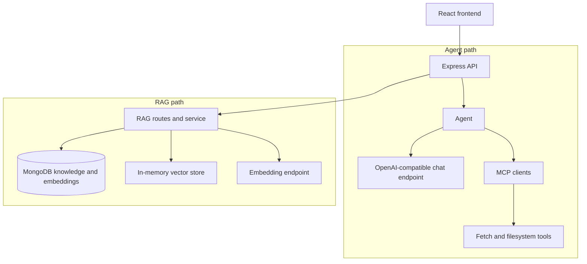

# LLM + MCP + RAG in TypeScript

> An experimental TypeScript project for exploring OpenAI-compatible chat, MCP tool calls, and MongoDB-backed knowledge and embedding management—without LangChain or LlamaIndex.

[](https://www.typescriptlang.org/)
[](https://nodejs.org/)
[](https://pnpm.io/)
[](https://github.com/modelcontextprotocol/typescript-sdk)

## Demo

[](https://www.youtube.com/watch?v=bXcvtlj1xRg)

## What this project demonstrates

- **OpenAI-compatible chat** — a small chat client that sends requests to a compatible chat-completions endpoint.
- **MCP tool calls** — an Agent connects to the included Fetch and filesystem MCP clients, then feeds a tool result back into the model.
- **Knowledge and embeddings** — the admin UI stores documents and embeddings in MongoDB; retrieval uses an in-memory cosine-similarity vector store.

## Current scope

This is an experimental learning project, not a production deployment template. The Agent chat and RAG retrieval paths are currently separate:

- The chat page can call the Agent and its MCP tools.
- The RAG routes and admin pages manage documents, embeddings, and retrieval.
- The web chat does **not** currently combine uploaded documents with Agent responses for end-to-end document Q&A.

The project avoids LangChain and LlamaIndex, but it is not dependency-free. It does not include authentication, queues, file upload, or a dedicated vector database.

## Quick start

### Requirements

- Node.js **18.16+**
- pnpm **10.6.3**
- MongoDB for the API server and admin/RAG routes
- An OpenAI-compatible chat endpoint and an embedding endpoint that supports `BAAI/bge-m3`
- `uv`/`uvx` for the Fetch MCP server and `npx` for the filesystem MCP server

### 1. Install dependencies

```bash
git clone https://github.com/NEDONION/llm-mcp-rag-typescript.git
cd llm-mcp-rag-typescript
pnpm run setup
```

Install `uv` if you want to use the Fetch MCP server. The filesystem MCP server is launched through `npx`.

### 2. Create `.env`

Create a `.env` file in the repository root:

```dotenv
# OpenAI-compatible chat endpoint
OPENAI_API_KEY=your_chat_api_key
OPENAI_BASE_URL=https://your-chat-endpoint/v1

# OpenAI-compatible embeddings endpoint
EMBEDDING_KEY=your_embedding_api_key
EMBEDDING_BASE_URL=https://your-embedding-endpoint/v1

# MongoDB used by the API server and admin pages
DATABASE_URL=mongodb://127.0.0.1:27017/llm_mcp_rag
```

### 3. Run a retrieval smoke test

```bash
pnpm run dev
```

This runs `src/index.ts`, which embeds the sample `knowledge/` documents and prints RAG retrieval results. It is a RAG smoke-test path, **not** the complete application launcher.

### 4. Run the web application

```bash
pnpm run all
```

This starts the Express API at `http://localhost:3000` and the Vite frontend at `http://localhost:5173`.

## Entry points

| URL | Purpose |
| --- | --- |
| [`/`](http://localhost:5173/) | Chat UI for the Agent/MCP path. |
| [`/admin`](http://localhost:5173/admin) | Knowledge document administration. |
| [`/admin/rag`](http://localhost:5173/admin/rag) | Embedding and in-memory retrieval administration. |

The backend exposes Agent, knowledge, and RAG endpoints under `/api`. The frontend proxies `/api` requests to the server on port 3000 during development.

## How it fits together


```mermaid
flowchart TB
  UI[React frontend] --> API[Express API]

  subgraph Agent path
    API --> Agent[Agent]
    Agent --> Chat[OpenAI-compatible chat endpoint]
    Agent --> MCP[MCP clients]
    MCP --> Tools[Fetch and filesystem tools]
  end

  subgraph RAG path
    API --> RAG[RAG routes and service]
    RAG --> Mongo[(MongoDB knowledge and embeddings)]
    RAG --> Memory[In-memory vector store]
    RAG --> Embed[Embedding endpoint]
  end
```

The two paths share the API and frontend, but the current UI does not wire retrieved RAG context into the Agent chat flow.


For the detailed diagrams, see [architecture-diagram.md](architecture-diagram.md).

## Useful scripts

```bash
pnpm run build   # Compile the TypeScript backend
pnpm run start   # Run the compiled backend entry point
pnpm run server  # Start only the Express API on port 3000
pnpm run dev     # Run the RAG smoke test in src/index.ts
pnpm run all     # Start the API and Vite frontend together
```

## MCP references

- [Model Context Protocol architecture](https://modelcontextprotocol.io/docs/concepts/architecture)
- [Build an MCP client](https://modelcontextprotocol.io/quickstart/client)
- [Fetch MCP server](https://github.com/modelcontextprotocol/servers/tree/main/src/fetch)
- [Filesystem MCP server](https://github.com/modelcontextprotocol/servers/tree/main/src/filesystem)

## Contributing

Issues and pull requests are welcome. Please keep changes focused, document any new environment variables, and update the relevant run instructions when behavior changes.
