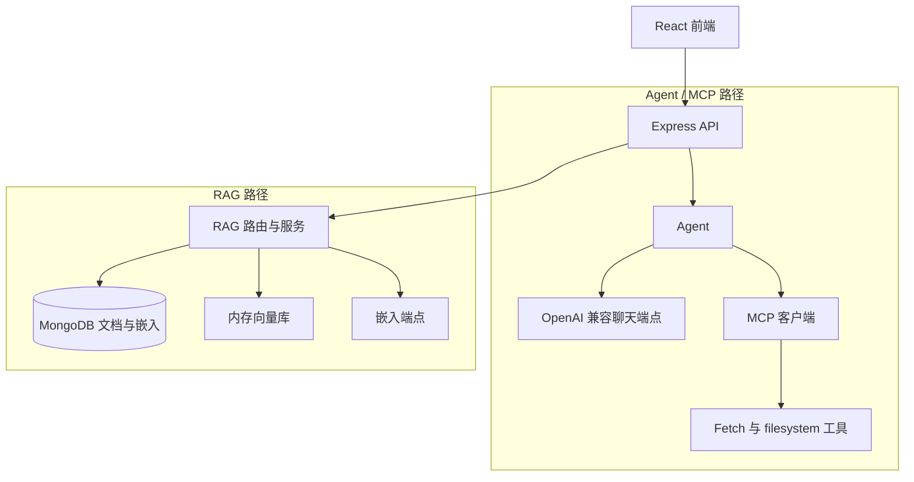

<h1 align="center">LLM + MCP + RAG in TypeScript</h1>

<p align="center"><strong>不用 LangChain 或 LlamaIndex，从代码拆解 Agent、MCP 与 RAG。</strong></p>

<p align="center">
  <a href="README.md">简体中文</a> ·
  <a href="README_EN.md">English</a>
</p>

<p align="center">
  <a href="https://www.typescriptlang.org/"></a>
  <a href="https://nodejs.org/"></a>
  <a href="https://pnpm.io/"></a>
  <a href="https://github.com/modelcontextprotocol/typescript-sdk"></a>
</p>

<p align="center">
  <a href="#演示">演示</a> ·
  <a href="#能力">能力</a> ·
  <a href="#快速开始">快速开始</a> ·
  <a href="#入口">入口</a> ·
  <a href="#工作原理">工作原理</a> ·
  <a href="#已知限制">限制</a>
</p>

这个实验项目把三条学习路径并排展开：可调用 MCP 工具的 Agent 对话、知识文档与嵌入管理，以及
内存向量检索。每条路径都能单独读懂和运行，适合想看清 OpenAI 兼容 API、MCP 与 RAG 基础组成的人。

<a id="demo"></a>
## 演示

<p align="center">
  <a href="https://www.youtube.com/watch?v=bXcvtlj1xRg"></a>
</p>

<p align="center"><sub>从 Web 对话到 MCP 工具调用：先看实际交互，再回到代码拆解每个边界。</sub></p>

<a id="capabilities"></a>
## 能力

| 能力 | 当前项目提供的行为 |
| --- | --- |
| **Agent 对话** | 通过 OpenAI 兼容的 chat-completions 端点发起流式对话。 |
| **MCP 工具** | Agent 连接 Fetch 与 filesystem MCP 客户端，将工具结果交还模型继续推理。 |
| **知识管理** | 管理后台将文档与嵌入保存到 MongoDB，便于观察知识数据的进入过程。 |
| **RAG 检索** | RAG 路由使用嵌入服务和内存余弦相似度向量库完成检索。 |

> [!IMPORTANT]
> 这是一个学习和实验项目，不是生产部署模板。Agent/MCP 对话与 RAG 检索目前**明确分离**：聊天页可以
> 调用 Agent 和 MCP 工具；RAG 与管理页负责文档、嵌入和检索；Web 聊天尚未把已管理的知识文档的检索结果注入
> Agent 回复，因此它不是端到端文档问答示例。

<a id="quick-start"></a>
## 快速开始

### 前置条件

- Node.js **20+**
- pnpm **10.6.3**
- MongoDB：供 API 服务、管理页与 RAG 路由使用
- 提供当前 Web Agent 路由所用 `gpt-4` 模型 ID 的 OpenAI 兼容聊天端点
- 支持 `BAAI/bge-m3` 的嵌入端点
- 当前 Agent/MCP 对话还需要 `uv`/`uvx` 与 `npx`；纯 RAG 管理和检索不需要 `uv`

### 1. 安装依赖

```bash
git clone https://github.com/NEDONION/llm-mcp-rag-typescript.git
cd llm-mcp-rag-typescript
pnpm run setup
```

使用当前 Agent 聊天前请安装 `uv`：Fetch MCP 服务由 `uvx` 初始化，filesystem MCP 服务由 `npx` 初始化。

### 2. 创建 `.env`

在仓库根目录创建 `.env`：

```dotenv
# OpenAI 兼容聊天端点
OPENAI_API_KEY=your_chat_api_key
OPENAI_BASE_URL=https://your-chat-endpoint/v1

# OpenAI 兼容嵌入端点
EMBEDDING_KEY=your_embedding_api_key
EMBEDDING_BASE_URL=https://your-embedding-endpoint/v1

# API 服务和管理页使用的 MongoDB
DATABASE_URL=mongodb://127.0.0.1:27017/llm_mcp_rag
```

### 3. 启动 Web 应用

```bash
pnpm run all
```

随后打开 [http://localhost:5173](http://localhost:5173)。Express API 运行在 `http://localhost:3000`，Vite
前端运行在 `http://localhost:5173`。

<a id="entry-points"></a>
## 入口

| 地址 | 用途 |
| --- | --- |
| [`/`](http://localhost:5173/) | Agent/MCP 对话界面。 |
| [`/admin`](http://localhost:5173/admin) | 知识文档管理。 |
| [`/admin/rag`](http://localhost:5173/admin/rag) | 嵌入与内存检索管理。 |

后端在 `/api` 下提供 Agent、知识库和 RAG 接口；开发时前端会把 `/api` 请求代理到 3000 端口的服务。

<a id="how-it-works"></a>
## 工作原理


```mermaid
flowchart TB
  UI[React 前端] --> API[Express API]

  subgraph AgentMCP[Agent / MCP 路径]
    API --> Agent[Agent]
    Agent --> Chat[OpenAI 兼容聊天端点]
    Agent --> MCP[MCP 客户端]
    MCP --> Tools[Fetch 与 filesystem 工具]
  end

  subgraph RAG[RAG 路径]
    API --> Retrieval[RAG 路由与服务]
    Retrieval --> Mongo[(MongoDB 文档与嵌入)]
    Retrieval --> Memory[内存向量库]
    Retrieval --> Embed[嵌入端点]
  end
```

两条路径共享 API 和前端，但当前 UI 不会把 RAG 检索到的上下文接入 Agent 对话。这条边界是有意写出来的，
方便你分别理解工具调用与检索增强，而不把尚未实现的整合包装成能力。


<a id="limitations"></a>
## 已知限制

- `pnpm run dev` 指向 `src/index.ts`，这是一个未完成的 legacy RAG 实验入口，目前不能稳定通过类型检查或
  运行；它不是快速开始的验证路径。
- 仓库中的 legacy 架构文档未反映当前 Agent 与 RAG 路径的分离状态，不应作为运行指导。
- 项目未提供认证、队列、文件上传或专用向量数据库。

## 常用脚本

```bash
pnpm run setup   # 安装后端与前端依赖
pnpm run server  # 只启动 3000 端口的 Express API
pnpm run all     # 同时启动 API 与 Vite 前端
```

`dev` 脚本以及后端 `build`/`start` 路径仍包含上述未完成的 legacy 入口。

## MCP 参考

- [Model Context Protocol 架构](https://modelcontextprotocol.io/docs/concepts/architecture)
- [构建 MCP 客户端](https://modelcontextprotocol.io/quickstart/client)
- [Fetch MCP 服务](https://github.com/modelcontextprotocol/servers/tree/main/src/fetch)
- [Filesystem MCP 服务](https://github.com/modelcontextprotocol/servers/tree/main/src/filesystem)

## 贡献

欢迎通过 [Issues](https://github.com/NEDONION/llm-mcp-rag-typescript/issues) 反馈问题与想法，也欢迎提交小而
聚焦的 Pull Request。请为新增环境变量补充说明，并在行为变化时同步更新运行指引。
