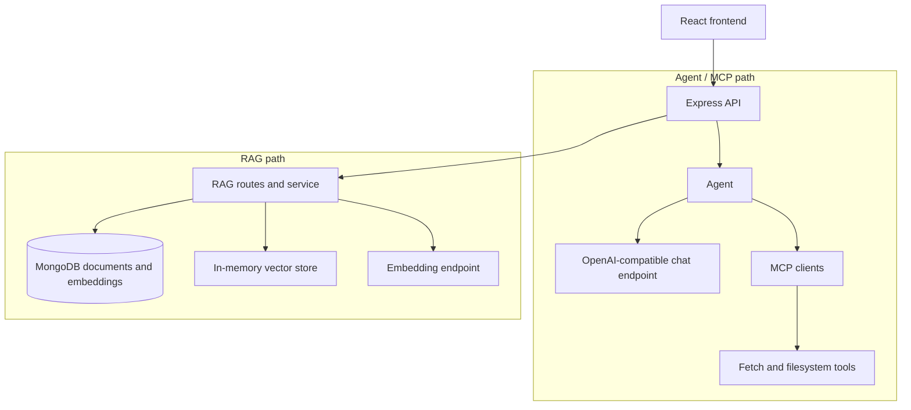

<h1 align="center">LLM + MCP + RAG in TypeScript</h1>

<p align="center"><strong>Understand Agent, MCP, and RAG from the code—without LangChain or LlamaIndex.</strong></p>

<p align="center">
  <a href="README.md">简体中文</a> ·
  <a href="README_EN.md">English</a>
</p>

<p align="center">
  <a href="https://www.typescriptlang.org/"></a>
  <a href="https://nodejs.org/"></a>
  <a href="https://pnpm.io/"></a>
  <a href="https://github.com/modelcontextprotocol/typescript-sdk"></a>
</p>

<p align="center">
  <a href="#demo">Demo</a> ·
  <a href="#capabilities">Capabilities</a> ·
  <a href="#quick-start">Quick Start</a> ·
  <a href="#entry-points">Entry Points</a> ·
  <a href="#how-it-works">How It Works</a> ·
  <a href="#known-limitations">Limitations</a>
</p>

This experimental project lays out three learning paths side by side: an Agent chat that calls MCP
tools, knowledge and embedding management, and in-memory vector retrieval. Each path is small
enough to study and run on its own, for people who want to see the foundations behind
OpenAI-compatible APIs, MCP, and RAG.

<a id="demo"></a>
## Demo

<p align="center">
  <a href="https://www.youtube.com/watch?v=bXcvtlj1xRg"></a>
</p>

<p align="center"><sub>See the Web chat and MCP tool calls first, then trace the boundaries in code.</sub></p>

<a id="capabilities"></a>
## Capabilities

| Capability | What the project currently does |
| --- | --- |
| **Agent chat** | Sends streaming chat requests through an OpenAI-compatible chat-completions endpoint. |
| **MCP tools** | Connects the Agent to Fetch and filesystem MCP clients, then returns tool results to the model. |
| **Knowledge management** | Stores documents and embeddings in MongoDB through the admin interface. |
| **RAG retrieval** | Uses an embedding endpoint and an in-memory cosine-similarity vector store for retrieval. |

> [!IMPORTANT]
> This is a learning and experimental project, not a production deployment template. The Agent/MCP
> chat and RAG retrieval paths are **deliberately separate** today: the chat page can call the Agent
> and MCP tools; the RAG and admin pages manage documents, embeddings, and retrieval; the Web chat
> does not inject retrieved context from managed knowledge documents into Agent responses, so this
> is not an end-to-end document-Q&A example.

<a id="quick-start"></a>
## Quick Start

### Prerequisites

- Node.js **20+**
- pnpm **10.6.3**
- MongoDB for the API server, admin pages, and RAG routes
- An OpenAI-compatible chat endpoint that serves the `gpt-4` model ID used by the current Web Agent route
- An embedding endpoint that supports `BAAI/bge-m3`
- `uv`/`uvx` and `npx` for the current Agent/MCP chat path; pure RAG administration and retrieval do not require `uv`

### 1. Install dependencies

```bash
git clone https://github.com/NEDONION/llm-mcp-rag-typescript.git
cd llm-mcp-rag-typescript
pnpm run setup
```

Install `uv` before using the current Agent chat: the Fetch MCP server is initialized through
`uvx`, and the filesystem MCP server through `npx`.

### 2. Create `.env`

Create `.env` at the repository root:

```dotenv
# OpenAI-compatible chat endpoint
OPENAI_API_KEY=your_chat_api_key
OPENAI_BASE_URL=https://your-chat-endpoint/v1

# OpenAI-compatible embedding endpoint
EMBEDDING_KEY=your_embedding_api_key
EMBEDDING_BASE_URL=https://your-embedding-endpoint/v1

# MongoDB used by the API server and admin pages
DATABASE_URL=mongodb://127.0.0.1:27017/llm_mcp_rag
```

### 3. Start the Web application

```bash
pnpm run all
```

Then open [http://localhost:5173](http://localhost:5173). The Express API runs at
`http://localhost:3000`; the Vite frontend runs at `http://localhost:5173`.

<a id="entry-points"></a>
## Entry Points

| URL | Purpose |
| --- | --- |
| [`/`](http://localhost:5173/) | Agent/MCP chat interface. |
| [`/admin`](http://localhost:5173/admin) | Knowledge document administration. |
| [`/admin/rag`](http://localhost:5173/admin/rag) | Embedding and in-memory retrieval administration. |

The backend exposes Agent, knowledge, and RAG endpoints under `/api`; during development, the
frontend proxies `/api` requests to the server on port 3000.

<a id="how-it-works"></a>
## How It Works



The paths share an API and frontend, but the current UI does not feed RAG-retrieved context into the
Agent chat. That boundary is explicit so you can study tool use and retrieval independently instead
of mistaking an unimplemented integration for a feature.


<a id="limitations"></a>
## Known Limitations

- `pnpm run dev` points to `src/index.ts`, an incomplete legacy RAG experiment that does not
  currently type-check or run reliably; it is not a Quick Start verification path.
- The repository's legacy architecture document does not reflect the current separation of Agent and
  RAG paths, so it should not be used as run guidance.
- The project does not provide authentication, queues, file upload, or a dedicated vector database.

## Useful Scripts

```bash
pnpm run setup   # Install backend and frontend dependencies
pnpm run server  # Start only the Express API on port 3000
pnpm run all     # Start the API and Vite frontend together
```

The `dev` script and the backend `build`/`start` path still include the incomplete legacy entry point
described above.

## MCP References

- [Model Context Protocol architecture](https://modelcontextprotocol.io/docs/concepts/architecture)
- [Build an MCP client](https://modelcontextprotocol.io/quickstart/client)
- [Fetch MCP server](https://github.com/modelcontextprotocol/servers/tree/main/src/fetch)
- [Filesystem MCP server](https://github.com/modelcontextprotocol/servers/tree/main/src/filesystem)

## Contributing

[Issues](https://github.com/NEDONION/llm-mcp-rag-typescript/issues), ideas, and small focused pull
requests are welcome. Please document new environment variables and update the relevant run
instructions whenever behavior changes.
