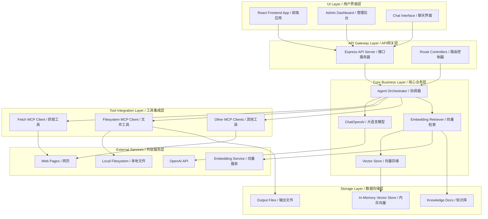
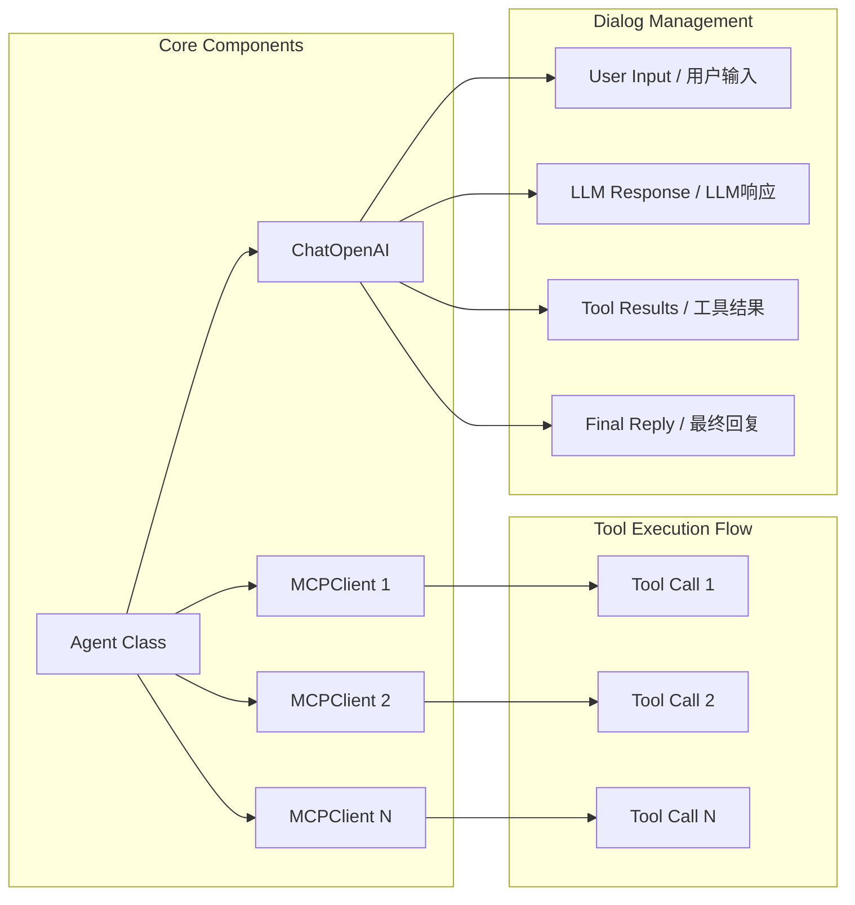
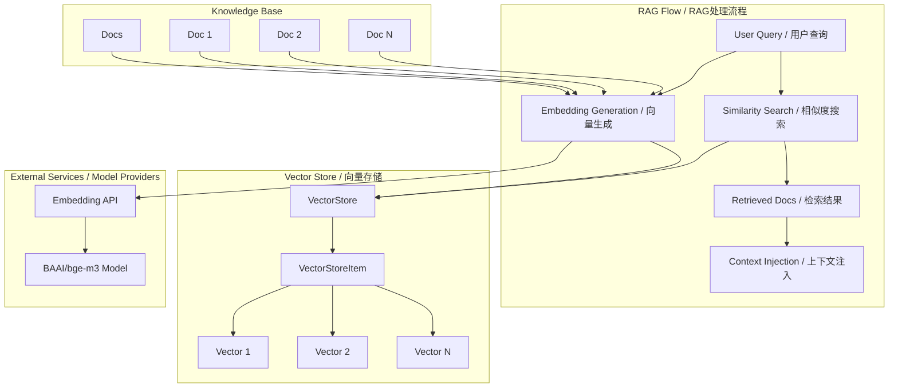
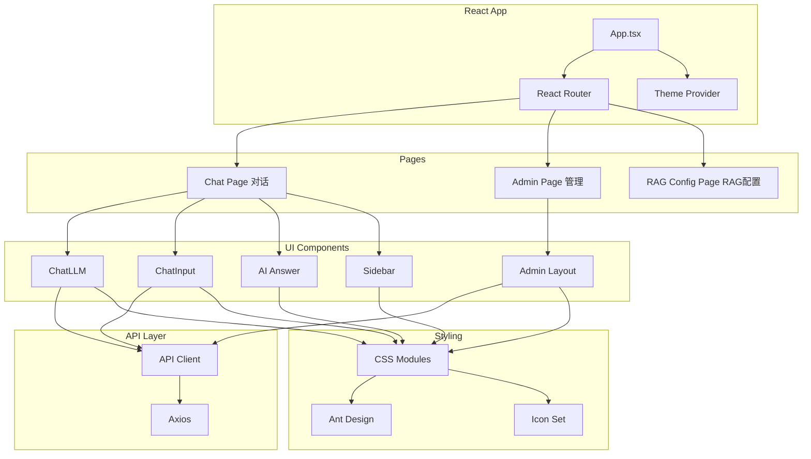
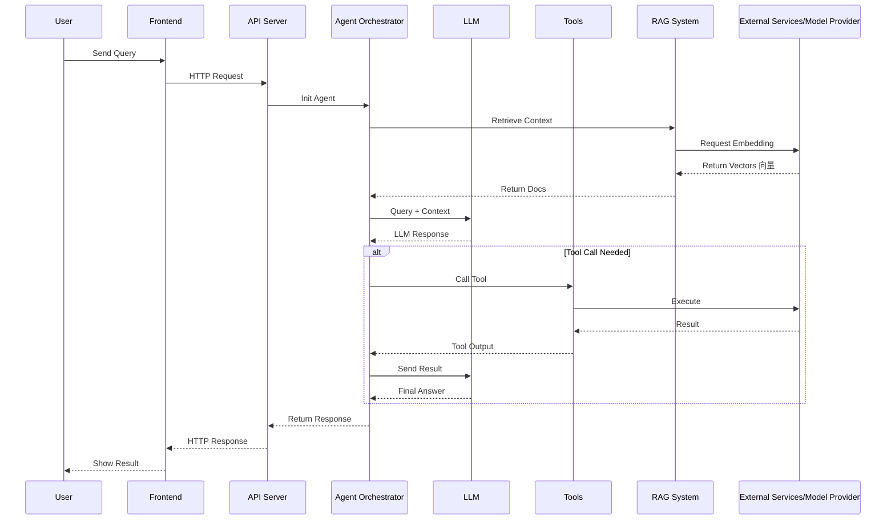

# LLM + MCP + RAG Overall System Architecture

## System Architecture 

```mermaid
graph TB
    subgraph "UI Layer / 用户界面层"
        UI[React Frontend App / 前端应用]
        Admin[Admin Dashboard / 管理后台]
        Chat[Chat Interface / 聊天界面]
    end
    
    subgraph "API Gateway Layer / API网关层"
        API[Express API Server / 接口服务器]
        Routes[Route Controllers / 路由控制器]
    end
    
    subgraph "Core Business Layer / 核心业务层"
        Agent[Agent Orchestrator / 协调器]
        LLM[ChatOpenAI / 大语言模型]
        RAG[Embedding Retriever / 向量检索]
        VectorStore[Vector Store / 向量存储]
    end
    
    subgraph "Tool Integration Layer / 工具集成层"
        MCP1[Fetch MCP Client / 抓取工具]
        MCP2[Filesystem MCP Client / 文件工具]
        MCP3[Other MCP Clients / 其他工具]
    end
    
    subgraph "External Services / 外部服务层"
        OpenAI[OpenAI API]
        EmbeddingAPI[Embedding Service / 向量服务]
        Web[Web Pages / 网页]
        FileSystem[Local Filesystem / 本地文件]
    end
    
    subgraph "Storage Layer / 数据存储层"
        Knowledge[Knowledge Docs / 知识库]
        Output[Output Files / 输出文件]
        Memory[In-Memory Vector Store / 内存向量]
    end
    
    %% Connections
    UI --> API
    Admin --> API
    Chat --> API
    
    API --> Agent
    Routes --> Agent
    
    Agent --> LLM
    Agent --> MCP1
    Agent --> MCP2
    Agent --> MCP3
    Agent --> RAG
    
    RAG --> VectorStore
    RAG --> EmbeddingAPI
    
    MCP1 --> Web
    MCP2 --> FileSystem
    MCP3 --> Web
    
    LLM --> OpenAI
    
    RAG --> Knowledge
    VectorStore --> Memory
    MCP2 --> Output
```

## Agent Internal Architecture

```mermaid
graph LR
    subgraph "Core Components"
        A[Agent Class]
        C[ChatOpenAI]
        M1[MCPClient 1]
        M2[MCPClient 2]
        M3[MCPClient N]
    end
    
    subgraph "Tool Execution Flow"
        T1[Tool Call 1]
        T2[Tool Call 2]
        T3[Tool Call N]
    end
    
    subgraph "Dialog Management"
        D1[User Input / 用户输入]
        D2[LLM Response / LLM响应]
        D3[Tool Results / 工具结果]
        D4[Final Reply / 最终回复]
    end
    
    A --> C
    A --> M1
    A --> M2
    A --> M3
    
    C --> D1
    C --> D2
    C --> D3
    C --> D4
    
    M1 --> T1
    M2 --> T2
    M3 --> T3
```

## RAG Architecture

```mermaid
graph TB
    subgraph "RAG Flow / RAG处理流程"
        Q[User Query / 用户查询]
        E[Embedding Generation / 向量生成]
        S[Similarity Search / 相似度搜索]
        R[Retrieved Docs / 检索结果]
        C[Context Injection / 上下文注入]
    end
    
    subgraph "Vector Store / 向量存储"
        VS[VectorStore]
        VI[VectorStoreItem]
        V1[Vector 1]
        V2[Vector 2]
        VN[Vector N]
    end
    
    subgraph "Knowledge Base"
        KB[Docs]
        K1[Doc 1]
        K2[Doc 2]
        KN[Doc N]
    end
    
    subgraph "External Services / Model Providers"
        EM[Embedding API]
        BGE[BAAI/bge-m3 Model]
    end
    
    Q --> E
    E --> EM
    EM --> BGE
    
    KB --> E
    K1 --> E
    K2 --> E
    KN --> E
    
    E --> VS
    VS --> VI
    VI --> V1
    VI --> V2
    VI --> VN
    
    Q --> S
    S --> VS
    S --> R
    R --> C
```

## Frontend Architecture

```mermaid
graph TB
    subgraph "React App"
        App[App.tsx]
        Router[React Router]
        Theme[Theme Provider]
    end
    
    subgraph "Pages"
        ChatPage[Chat Page 对话]
        AdminPage[Admin Page 管理]
        RAGPage[RAG Config Page RAG配置]
    end
    
    subgraph "UI Components"
        ChatLLM[ChatLLM]
        ChatInput[ChatInput]
        AIAnswer[AI Answer]
        Sidebar[Sidebar]
        AdminLayout[Admin Layout]
    end
    
    subgraph "API Layer"
        APIClient[API Client]
        Axios[Axios]
    end
    
    subgraph "Styling"
        CSS[CSS Modules]
        Antd[Ant Design]
        Icons[Icon Set]
    end
    
    App --> Router
    App --> Theme
    
    Router --> ChatPage
    Router --> AdminPage
    Router --> RAGPage
    
    ChatPage --> ChatLLM
    ChatPage --> ChatInput
    ChatPage --> AIAnswer
    ChatPage --> Sidebar
    
    AdminPage --> AdminLayout
    
    ChatLLM --> APIClient
    ChatInput --> APIClient
    AdminLayout --> APIClient
    
    APIClient --> Axios
    
    ChatLLM --> CSS
    ChatInput --> CSS
    AIAnswer --> CSS
    Sidebar --> CSS
    AdminLayout --> CSS
    
    CSS --> Antd
    CSS --> Icons
```

## Data Flow Sequence Diagram

```mermaid
sequenceDiagram
    participant User as User
    participant UI as Frontend
    participant API as API Server
    participant Agent as Agent Orchestrator
    participant LLM as LLM
    participant MCP as Tools
    participant RAG as RAG System
    participant External as External Services/Model Provider
    
    User->>UI: Send Query
    UI->>API: HTTP Request
    API->>Agent: Init Agent
    Agent->>RAG: Retrieve Context
    RAG->>External: Request Embedding
    External-->>RAG: Return Vectors 向量
    RAG-->>Agent: Return Docs
    
    Agent->>LLM: Query + Context
    LLM-->>Agent: LLM Response
    
    alt Tool Call Needed
        Agent->>MCP: Call Tool
        MCP->>External: Execute
        External-->>MCP: Result
        MCP-->>Agent: Tool Output
        Agent->>LLM: Send Result
        LLM-->>Agent: Final Answer
    end
    
    Agent-->>API: Return Response
    API-->>UI: HTTP Response
    UI-->>User: Show Result

```