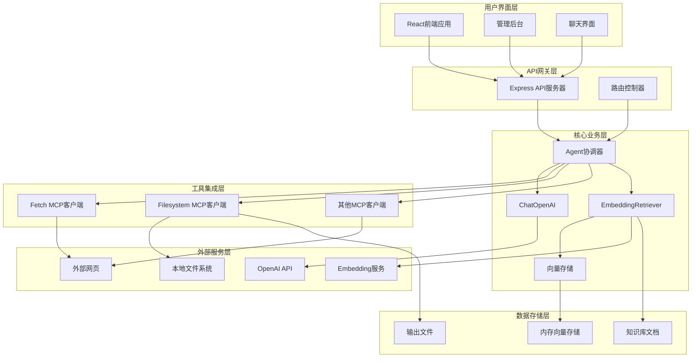
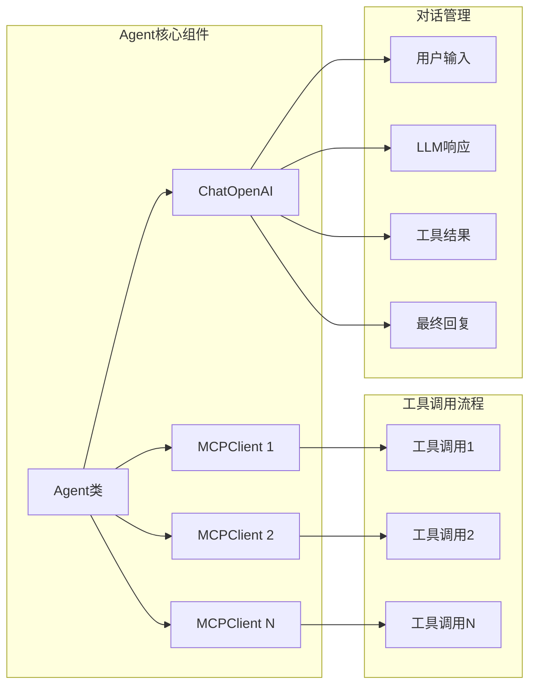
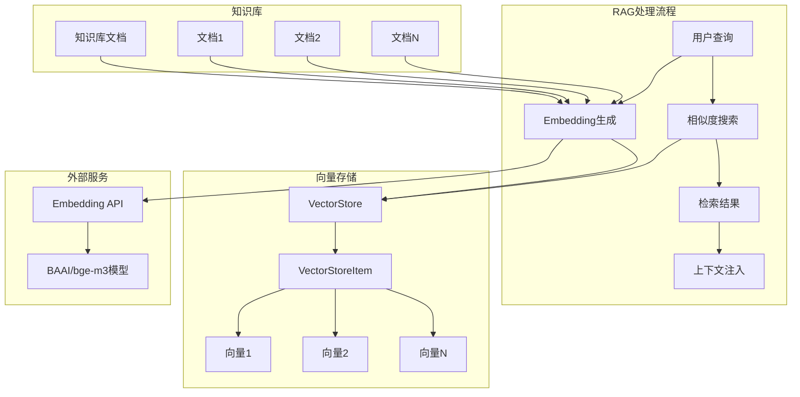
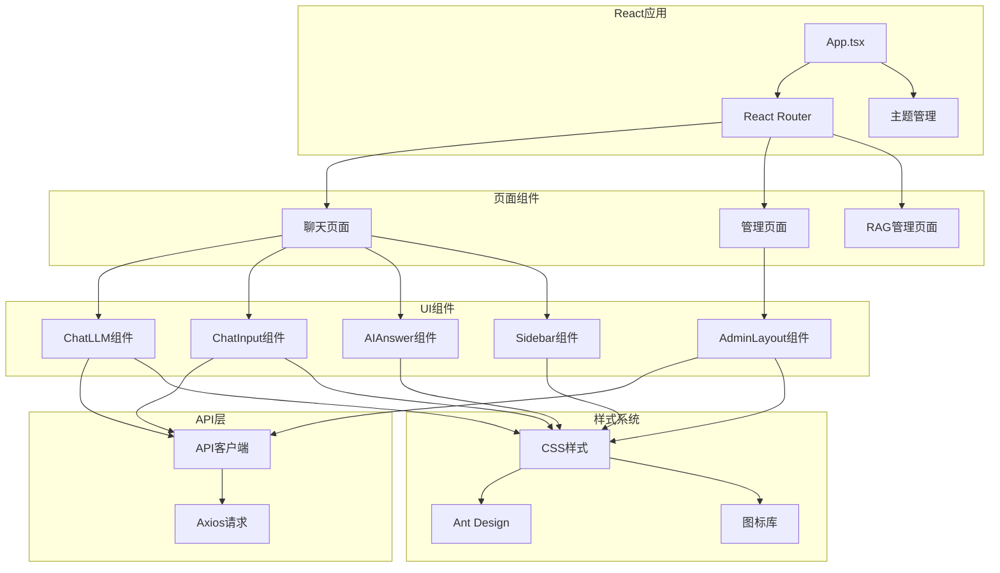
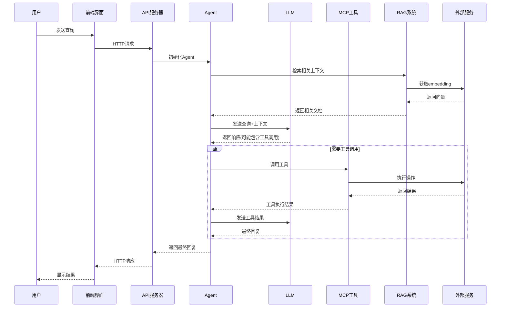
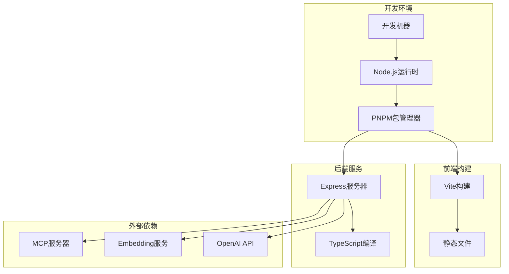
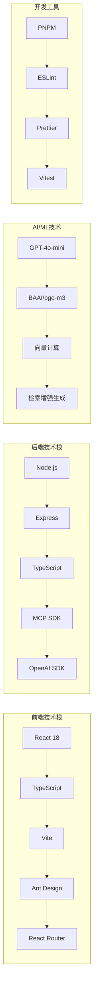

# LLM + MCP + RAG 项目架构图

## 整体系统架构

```mermaid
graph TB
    subgraph "用户界面层"
        UI[React前端应用]
        Admin[管理后台]
        Chat[聊天界面]
    end
    
    subgraph "API网关层"
        API[Express API服务器]
        Routes[路由控制器]
    end
    
    subgraph "核心业务层"
        Agent[Agent协调器]
        LLM[ChatOpenAI]
        RAG[EmbeddingRetriever]
        VectorStore[向量存储]
    end
    
    subgraph "工具集成层"
        MCP1[Fetch MCP客户端]
        MCP2[Filesystem MCP客户端]
        MCP3[其他MCP客户端]
    end
    
    subgraph "外部服务层"
        OpenAI[OpenAI API]
        EmbeddingAPI[Embedding服务]
        Web[外部网页]
        FileSystem[本地文件系统]
    end
    
    subgraph "数据存储层"
        Knowledge[知识库文档]
        Output[输出文件]
        Memory[内存向量存储]
    end
    
    %% 用户界面层连接
    UI --> API
    Admin --> API
    Chat --> API
    
    %% API层连接
    API --> Agent
    Routes --> Agent
    
    %% 核心业务层连接
    Agent --> LLM
    Agent --> MCP1
    Agent --> MCP2
    Agent --> MCP3
    Agent --> RAG
    
    RAG --> VectorStore
    RAG --> EmbeddingAPI
    
    %% 工具集成层连接
    MCP1 --> Web
    MCP2 --> FileSystem
    MCP3 --> Web
    
    %% 外部服务连接
    LLM --> OpenAI
    
    %% 数据存储连接
    RAG --> Knowledge
    VectorStore --> Memory
    MCP2 --> Output
```

## Agent内部架构

```mermaid
graph LR
    subgraph "Agent核心组件"
        A[Agent类]
        C[ChatOpenAI]
        M1[MCPClient 1]
        M2[MCPClient 2]
        M3[MCPClient N]
    end
    
    subgraph "工具调用流程"
        T1[工具调用1]
        T2[工具调用2]
        T3[工具调用N]
    end
    
    subgraph "对话管理"
        D1[用户输入]
        D2[LLM响应]
        D3[工具结果]
        D4[最终回复]
    end
    
    A --> C
    A --> M1
    A --> M2
    A --> M3
    
    C --> D1
    C --> D2
    C --> D3
    C --> D4
    
    M1 --> T1
    M2 --> T2
    M3 --> T3
```

## RAG系统架构

```mermaid
graph TB
    subgraph "RAG处理流程"
        Q[用户查询]
        E[Embedding生成]
        S[相似度搜索]
        R[检索结果]
        C[上下文注入]
    end
    
    subgraph "向量存储"
        VS[VectorStore]
        VI[VectorStoreItem]
        V1[向量1]
        V2[向量2]
        VN[向量N]
    end
    
    subgraph "知识库"
        KB[知识库文档]
        K1[文档1]
        K2[文档2]
        KN[文档N]
    end
    
    subgraph "外部服务"
        EM[Embedding API]
        BGE[BAAI/bge-m3模型]
    end
    
    Q --> E
    E --> EM
    EM --> BGE
    
    KB --> E
    K1 --> E
    K2 --> E
    KN --> E
    
    E --> VS
    VS --> VI
    VI --> V1
    VI --> V2
    VI --> VN
    
    Q --> S
    S --> VS
    S --> R
    R --> C
```

## 前端架构

```mermaid
graph TB
    subgraph "React应用"
        App[App.tsx]
        Router[React Router]
        Theme[主题管理]
    end
    
    subgraph "页面组件"
        ChatPage[聊天页面]
        AdminPage[管理页面]
        RAGPage[RAG管理页面]
    end
    
    subgraph "UI组件"
        ChatLLM[ChatLLM组件]
        ChatInput[ChatInput组件]
        AIAnswer[AIAnswer组件]
        Sidebar[Sidebar组件]
        AdminLayout[AdminLayout组件]
    end
    
    subgraph "API层"
        APIClient[API客户端]
        Axios[Axios请求]
    end
    
    subgraph "样式系统"
        CSS[CSS样式]
        Antd[Ant Design]
        Icons[图标库]
    end
    
    App --> Router
    App --> Theme
    
    Router --> ChatPage
    Router --> AdminPage
    Router --> RAGPage
    
    ChatPage --> ChatLLM
    ChatPage --> ChatInput
    ChatPage --> AIAnswer
    ChatPage --> Sidebar
    
    AdminPage --> AdminLayout
    
    ChatLLM --> APIClient
    ChatInput --> APIClient
    AdminLayout --> APIClient
    
    APIClient --> Axios
    
    ChatLLM --> CSS
    ChatInput --> CSS
    AIAnswer --> CSS
    Sidebar --> CSS
    AdminLayout --> CSS
    
    CSS --> Antd
    CSS --> Icons
```

## 数据流架构

```mermaid
sequenceDiagram
    participant User as 用户
    participant UI as 前端界面
    participant API as API服务器
    participant Agent as Agent
    participant LLM as LLM
    participant MCP as MCP工具
    participant RAG as RAG系统
    participant External as 外部服务
    
    User->>UI: 发送查询
    UI->>API: HTTP请求
    API->>Agent: 初始化Agent
    Agent->>RAG: 检索相关上下文
    RAG->>External: 获取embedding
    External-->>RAG: 返回向量
    RAG-->>Agent: 返回相关文档
    
    Agent->>LLM: 发送查询+上下文
    LLM-->>Agent: 返回响应(可能包含工具调用)
    
    alt 需要工具调用
        Agent->>MCP: 调用工具
        MCP->>External: 执行操作
        External-->>MCP: 返回结果
        MCP-->>Agent: 工具执行结果
        Agent->>LLM: 发送工具结果
        LLM-->>Agent: 最终回复
    end
    
    Agent-->>API: 返回最终回复
    API-->>UI: HTTP响应
    UI-->>User: 显示结果
```

## 部署架构

```mermaid
graph TB
    subgraph "开发环境"
        Dev[开发机器]
        Node[Node.js运行时]
        PNPM[PNPM包管理器]
    end
    
    subgraph "前端构建"
        Build[Vite构建]
        Dist[静态文件]
    end
    
    subgraph "后端服务"
        Server[Express服务器]
        TS[TypeScript编译]
    end
    
    subgraph "外部依赖"
        OpenAI[OpenAI API]
        Embedding[Embedding服务]
        MCP[MCP服务器]
    end
    
    Dev --> Node
    Node --> PNPM
    PNPM --> Build
    PNPM --> Server
    
    Build --> Dist
    Server --> TS
    
    Server --> OpenAI
    Server --> Embedding
    Server --> MCP
```

## 技术栈架构

```mermaid
graph LR
    subgraph "前端技术栈"
        React[React 18]
        TypeScript[TypeScript]
        Vite[Vite]
        Antd[Ant Design]
        Router[React Router]
    end
    
    subgraph "后端技术栈"
        Node[Node.js]
        Express[Express]
        TS[TypeScript]
        MCP[MCP SDK]
        OpenAI[OpenAI SDK]
    end
    
    subgraph "AI/ML技术"
        LLM[GPT-4o-mini]
        Embedding[BAAI/bge-m3]
        Vector[向量计算]
        RAG[检索增强生成]
    end
    
    subgraph "开发工具"
        PNPM[PNPM]
        ESLint[ESLint]
        Prettier[Prettier]
        Vitest[Vitest]
    end
    
    React --> TypeScript
    TypeScript --> Vite
    Vite --> Antd
    Antd --> Router
    
    Node --> Express
    Express --> TS
    TS --> MCP
    MCP --> OpenAI
    
    LLM --> Embedding
    Embedding --> Vector
    Vector --> RAG
    
    PNPM --> ESLint
    ESLint --> Prettier
    Prettier --> Vitest
``` 