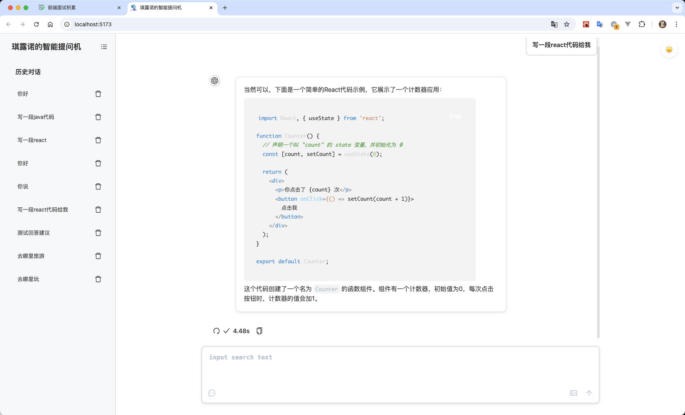

# 项目简介
 一个基于coze-api的AI对话LLM组件

 👏🏻支持流式输出ai对话并展示markdown格式

 ✍🏻支持图片、视频、音频、文件等类型消息的传输

 ⭐️记录历史对话折叠框

 ✨切换黑白主题

 🧉支持H5端适配

 使用时需要自行配置bot ID与api key，调整于根目录.env文件中

 后台官网：https://api.coze.com

 在线预览：https://charlotte21110.github.io/byteDanceLLM/
 
# node版本
node 18.18.0

技术栈：react+vite

项目管理：pnpm

工程化：vite vitest prettier eslint cz

CI：github actions

# 运行
``` cmd

npm install -g pnpm
pnpm prepare // 确保husky被正确安装
pnpm i
pnpm run dev
```
# 开发
需切换到develop分支开发，在该分支提代码，不允许直接提交到master，test分支

也可以自己新建一个分支提merge request合并

执行命令

``` cmd
git checkout develop
git pull origin develop
```
# 提交
在develop分支上提交代码（除非引入新的依赖，非必要不提交package.json，pnpm-lock.yaml）

提交之前记得拉取最新代码，若有冲突可自行解决或群友讨论

提交格式：（具体看cz-config.cjs文件）

feat: xxx (xxx为新增功能描述)

fix: xxx (xxx为修复bug描述)

``` cmd
git pull origin develop // 拉取最新代码
git add xxx.js // 示例添加文件
pnpm commit // 提交
git push origin develop // 推送到远程
```
# 界面预览
